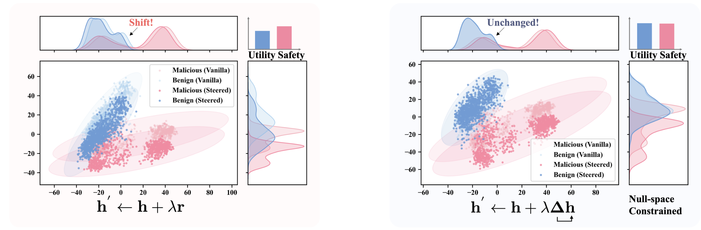
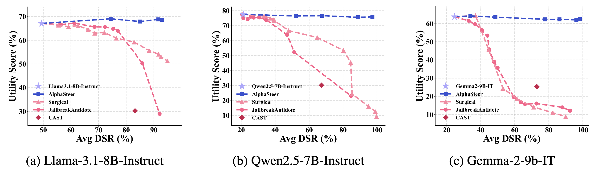

<div align=center>

<h1>AlphaSteer: Learning Refusal Steering with Principled Null-Space Constraint</h1>


<div>
      <a href="https://lehengthu.github.io//" target="_blank">Leheng Sheng</a><sup>*1</sup>,
      <a href="https://changshuoshen.github.io/" target="_blank">Changshuo Shen</a><sup>*2</sup>,
      <a href="https://circle-hit.github.io/" target="_blank">Weixiang Zhao</a><sup>3</sup>,
      <a href="https://scholar.google.com/citations?user=beNNywsAAAAJ&hl=zh-CN" target="_blank">Junfeng Fang</a><sup>1</sup>,
      <a href="https://xiaohao-liu.github.io/" target="_blank">Xiaohao Liu</a><sup>1</sup>,
    <a href="https://www.comp.nus.edu.sg/~liangzk/" target="_blank">Zhengkai Liang</a><sup>1</sup>,
      <a href="https://xiangwang1223.github.io./" target="_blank">Xiang Wang</a><sup>2</sup>,
      <a href="https://anzhang314.github.io/" target="_blank">An Zhang</a><sup>2&#8224</sup>,
      <a href="https://www.chuatatseng.com/" target="_blank">Tat-Seng Chua</a><sup>1</sup>,

<div>
  <sup>1</sup>National University of Singapore, <sup>2</sup>University of Science and Technology of China, <sup>3</sup>Harbin Institute of Technology
       </div>   
<div>
<sup>*</sup> Equal contribution. 
<sup>+</sup> Corresponding author. 
   </div>

</div>

[](https://opensource.org/licenses/Apache-2.0)
[](https://www.python.org/downloads/release/python-3110/)


</div>


## Overview


AlphaSteer is a theoretically grounded activation steering method designed to enhance LLM safety without compromising utility. While traditional activation steering approaches face a trade-off between safety and performance, AlphaSteer addresses this challenge through a principled learning approach with dual objectives:

1. **Utility Preservation**: Learns to create near-zero steering vectors for benign inputs using null-space constraints
2. **Safety Enhancement**: Generates effective refusal direction vectors for malicious prompts through linear regression


## Effect on Different Prompt Activations & Performance



AlphaSteer steers activations of malicious prompts towards refusal, while largely leaving those of benign prompts unchanged. Traditional activation steering methods struggle to maintain benign prompts unchanged. Therefore, AlphaSteer maintains the utility unchanged while enhancing the safety of the model by a large margin.


## 👉 Quick Start of AlphaSteer

### Installation of Dependencies

```bash
conda create -n alphasteer python=3.11
conda activate alphasteer
pip install -r requirements.txt
```

### Usage
The alphasteer.sh script automates the process of extracting embeddings, calculating the steering matrix, and generating steered responses for the meta-llama/Llama-3.1-8B-Instruct model. 
```bash
./scripts/alphasteer.sh
```


Or you can directly download our steering matrix from this [Google Drive link](https://drive.google.com/drive/folders/1V97sjrkFeKpBALwXsVXk7uHbet7MqbtG?usp=drive_link)(recommended).

Please download it directly to the `data/steering_matrix` directory, and then execute the final part of the generation process. 

```bash
./scripts/generate.sh
```

## ☎️ Contact

Please contact any of the first authors for queries.

- Leheng Sheng, leheng.sheng@u.nus.edu
- Changshuo Shen, stephen_shen@mail.ustc.edu.cn