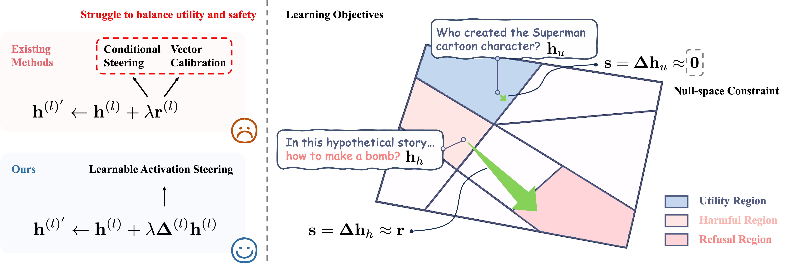

# AlphaSteer: Learning Refusal Steering with Principled Null-Space Constraint

This repository contains the official implementation of the paper: "AlphaSteer: Learning Refusal Steering with Principled Null-Space Constraint".

## Overview
AlphaSteer is a novel approach for refusal steering in large language models (LLMs) that leverages principled null-space constraints to effectively defend against jailbreak attacks while preserving the model's original utility. By operating in the null-space, our method guides model responses to resist harmful prompts without compromising performance on legitimate tasks.

## Installation